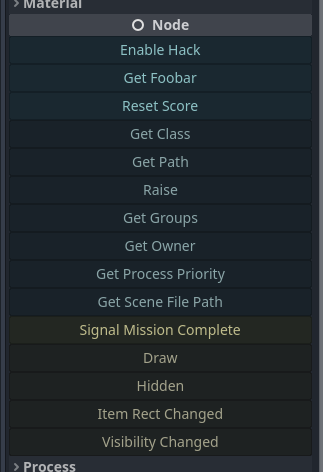
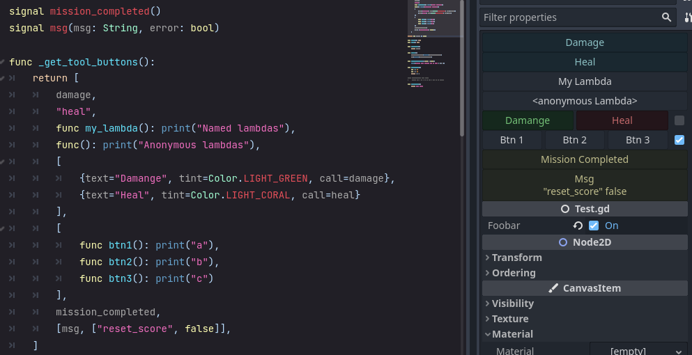
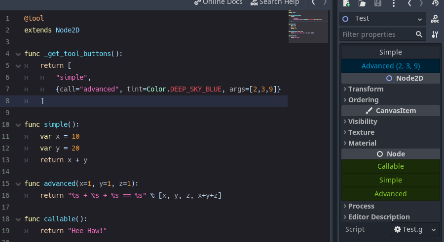

## ToolButtonPlugin for Godot 4.0 - v1.4

Editor buttons with ~~one line of code: `@tool`~~ zero lines of code.

Simply install, and select any node:

- Public methods will be listed at the bottom of editor panel.
- Signals with 0 arguments will also be shown.

For more advanced features, read below.



## Getting Started

- Enable plugin.
- Add `@tool` to top of your script.
- Buttons will be at the bottom of the inspector.
- Add a `_get_tool_buttons() -> Array` method.
- The array items can be:
	- Names of methods `"my_method"`
	- Names of signals `"my_signal"`
	- Arrays of names `["my_method", "method2", "a_signal"]`
	- Callables `my_method`
	- Bound Callables `method.bind(true, "ok" 1.0)`
	- Inline Callable `func(): print("Hey!")`
	- Inline Callable with name `func press_me(): print("You pressed me!")`
	- Arrays of callables `[method1, method2.bind("yes"), method2.bind("no")]`
	- Array with signal and arguments `["my_signal", [true, "ok"]]`
	- Arrays of strings and callables and signales and... `["method1", method2, "signal"]`
	- Dictionarys with fine tuned control: `{call=method.bind(true), text="My Method", tint=Color.RED}`


	
## Advanced Example

To specify buttons that show above the inspector, add a `_get_tool_buttons` func.



With `Strings`:
```gd
@tool
extends Node

func _get_tool_buttons():
	return [boost_score, remove_player]

func boost_score():
	Player.score += 100

func remove_player():
	Player.queue_free()
```
and/or `Callable`s

```gd
# WARNING, some stuff won't work: If you get *"Cannot access member without instance"*: https://github.com/godotengine/godot/issues/56780
@tool
extends Node

func _get_tool_buttons():
	return [
		func add_score(): score += 10,
		func reset_health(): health = 0
	]
```
and/or `Dictionarys`
```gd
@tool
extends Node

signal reset()

func _get_tool_buttons(): return [
	"boost_score",
	{call="boost_score", args=[100], tint=Color.DEEP_SKY_BLUE},
	{call="emit_signal", args=["reset"], text="Reset", tint=Color.TOMATO},
	{
		call=func(): print("My Health: ", health),
		text="Print Health",
		tint=func(): return Color(health * .1, 0.0, 0.0)
		lock=func(): return health == 100
	}
]

func boost_score(x=10):
	Player.score += x
```

`call` is mandatory. Other's are optional.

|key    |desc                           |default              |
|:------|:------------------------------|:--------------------|
|call   | Method to call.               | - |
|args   | Array of arguments to pass.<br>*(Mouse over button to see args.)*   | - |
|text   | Button label.                 | - |
|tint   | Button color.                 | Color.WHITE |
|icon   | Button icon.                  | -
|flat   | Button is flat style.         | false |
|hint   | Hint text for mouse over.     | - |
|print  | Print output of method call?  | true |
|align  | Button alignment.             | BoxContainer.ALIGNMENT_CENTER |
|lock   | Disable button?               | false |
|update_filesystem| Tells Godot editor to rescan file system. | false |


## Resource Example

For `_get_tool_buttons` to work on a `Resource` it needs to be static.

```gd
@tool
extends Resource
class_name MyResource

# STATIC
static func _get_tool_buttons():
	return ["my_button"]

# LOCAL
export(String) var my_name:String = ""

func my_button():
	print(my_name)
```

## Signals
```gd
signal my_signal()
signal my_arg_signal(x, y)

func _get_tool_buttons():
	return [
		my_signal,
		[my_arg_signal, [true, "okay"]]
	]
```

## Multi button support
You can have multiple buttons on the same line.<br>
They can all be called at once (default), or seperate, based on a toggle.
```
func _get_tool_buttons():
	return [
		[msg, msg.bind("yes"), msg.bind("no")],
	]

func msg(msg := "Default Message"):
	print("Got: ", msg)

func doit():
	pass
``` 

# Changes
## 1.4
- Added Signal support.
- Added support for multiple buttons in the same row.
- Added automatically generated buttons for testing public methods.
- Added automatically generated buttons for testing argumentless signals.
- Auto tint method buttons blue and signal buttons yellow.
- Lot's of little fixes.

## 1.3
- Added `@SELECT_AND_EDIT::file_path`, `@EDIT_RESOURCE::file_path`, `@SELECT_FILE::file_path`.

## 1.2
- Added 'Print Meta' button, which will print all meta data in an object.

## 1.1
- Updated for Godot `4.0.alpha2`
- Added `Callable` support `call` `text` `icon` `tint` `lock`: `{ text="Callable", call=func(): print("From Callable with love") }`
- Changed `disabled` to `lock`
- Bottom buttons are alphabetically sorted.


